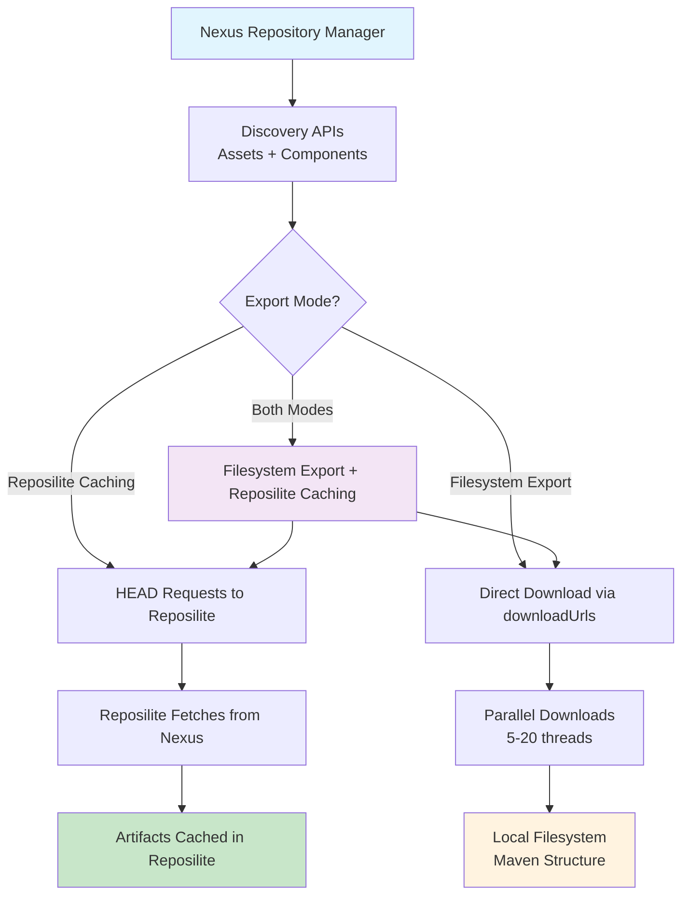

# Nexus Export Tool

A powerful command-line tool for working with Nexus Repository Manager artifacts. Supports both traditional Reposilite caching synchronization and direct filesystem export using Nexus downloadUrls.

## Overview

This tool connects to a Nexus Repository Manager instance and can:

1. **Cache in Reposilite**: Trigger caching requests in Reposilite using HTTP HEAD requests for efficient proxy caching
2. **Export to Filesystem**: Download artifacts directly from Nexus to local filesystem using downloadUrls for backups, migrations, or offline access

## Features

### Core Functionality

- **Dual Export Modes**: Choose between Reposilite caching or direct filesystem export
- **Nexus downloadUrl Support**: Uses official Nexus API downloadUrls for direct downloads
- **Full Repository Discovery**: Fetches ALL artifacts from Nexus repositories with pagination support
- **Multiple API Support**: Uses both Assets and Components APIs for maximum completeness
- **Repository Discovery**: List all available repositories in Nexus

### Filesystem Export (NEW)

- **Direct Downloads**: Download artifacts directly from Nexus using downloadUrls
- **Parallel Downloads**: Configurable parallel download threads (1-20) for performance
- **Directory Structure**: Preserve Maven directory structure or use flat structure
- **Resume Support**: Skip already downloaded files with size verification
- **Export Statistics**: Comprehensive download statistics and progress tracking

### Reposilite Integration (Original)

- **Efficient Caching**: Uses HEAD requests to trigger Reposilite caching without full downloads
- **Cache Validation**: Optional validation to ensure all artifacts are available in Reposilite

### User Experience

- **Command-Line Interface**: Flexible argument-based configuration with sensible defaults
- **Easy to Use**: Run with no arguments for a guided setup or use command-line flags
- **Comprehensive Logging**: Detailed logging to both console and timestamped log files
- **Progress Tracking**: Real-time statistics and progress reporting
- **Rate Limiting**: Configurable request rate limiting to avoid overwhelming servers
- **Authentication Support**: Supports Nexus authentication via username/password or environment variables
- **Robust Error Handling**: Handles network issues and API errors gracefully
- **Quiet Mode**: Optional reduced verbosity for automated deployments
- **Debug Mode**: Detailed logging for troubleshooting
- **Connectivity Testing**: Pre-sync checks to ensure Nexus is reachable

## Installation

1.  Clone this repository:

    ```bash
    git clone https://github.com/okeren-cap/reposilite-mirror-export.git

    ```

2.  Install Python 3.x if you haven't already.
3.  Install dependencies:
    ```bash
    pip install requests
    ```

## Quick Start

**List available repositories first:**

```bash
python3 nexus3_exporter.py --list-repositories --nexus-url <YOUR_NEXUS_URL> -u <USER>
```

**Run the synchronization:**

```bash
# Replace with your actual configuration
python3 nexus3_exporter.py \
    --nexus-url http://your-nexus-instance.com \
    --nexus-repository your-repo-name \
    --reposilite-url http://your-reposilite-instance.com \
    --reposilite-repository your-target-repo \
    -u your-nexus-user \
    -p your-nexus-password \
    --yes
```

> **Warning**
> It is strongly recommended to use environment variables or the interactive password prompt for credentials instead of passing them as command-line arguments.

## Usage

### Basic Usage

```bash
python3 nexus3_exporter.py [options]
```

### Examples

#### Discovery and Basic Operations

**List available repositories:**

```bash
python3 nexus3_exporter.py --list-repositories
```

#### Reposilite Caching (Original Functionality)

**Basic Reposilite sync with repository override:**

```bash
python3 nexus3_exporter.py --nexus-repository maven-releases
```

**Automated mode (skip confirmation, quiet output):**

```bash
python3 nexus3_exporter.py --yes --quiet
```

**Full custom Reposilite configuration:**

```bash
python3 nexus3_exporter.py \
    --nexus-url https://nexus.example.com \
    --nexus-repository core-releases \
    --reposilite-url http://localhost:8080 \
    --reposilite-repository releases \
    --nexus-username admin \
    --rate-limit 10
```

#### Filesystem Export (NEW Feature)

**Basic filesystem export:**

```bash
python3 nexus3_exporter.py --export-to-path /tmp/maven-export
```

**High-performance export with parallel downloads:**

```bash
python3 nexus3_exporter.py \
    --export-to-path ./artifacts \
    --export-parallel-downloads 10 \
    --yes
```

**Export-only mode (skip Reposilite entirely):**

```bash
python3 nexus3_exporter.py \
    --export-only \
    --export-to-path /backup/maven-repository
```

**Export AND cache in Reposilite simultaneously:**

```bash
python3 nexus3_exporter.py \
    --export-to-path /backup/maven \
    --reposilite-url http://localhost:8080
```

**Production-ready export with custom configuration:**

```bash
python3 nexus3_exporter.py \
    --nexus-url https://nexus.example.com \
    --nexus-repository core-releases \
    --export-to-path /mnt/artifacts \
    --export-parallel-downloads 15 \
    --nexus-username admin \
    --yes
```

_(You will be prompted for the password.)_

**Using an environment variable for the password:**

```bash
export NEXUS_PASSWORD=your-secret-password
python3 nexus3_exporter.py --nexus-username admin
```

## Command-Line Arguments

Run `python3 nexus3_exporter.py --help` for a full and up-to-date list of commands.

### Configuration

- `--nexus-url`: Your Nexus instance URL.
- `--nexus-repository`: The Nexus repository to sync from.
- `--reposilite-url`: Your Reposilite instance URL.
- `--reposilite-repository`: The target repository in Reposilite.

### Behavior

- `--rate-limit`, `-r`: Requests per second.
- `--yes`, `-y`: Skip confirmation prompt.
- `--quiet`, `-q`: Reduced verbosity.
- `--log-file`, `-l`: Custom log file path.
- `--debug`: Enable detailed debug logging.
- `--timeout`: Request timeout in seconds.

### Export Options

- `--export-to-path`: Export artifacts to local filesystem instead of/in addition to Reposilite caching
- `--preserve-structure`: Maintain Maven directory structure in export (default: True)
- `--export-parallel-downloads`: Number of parallel downloads for export (default: 5, max: 20)
- `--export-only`: Only export to filesystem, skip Reposilite caching entirely

### Actions

- `--list-repositories`: List available Nexus repositories and exit.

## Authentication

The tool supports multiple secure authentication methods:

1.  **Environment Variable (Recommended)**:

    ```bash
    export NEXUS_PASSWORD=your-secret-password
    python3 nexus3_exporter.py --nexus-username your-user
    ```

2.  **Interactive Password Prompt**:
    Omit the `--nexus-password` or `-p` flag, and the script will securely prompt for it.

    ```bash
    python3 nexus3_exporter.py --nexus-username your-user
    # Prompts for password
    ```

3.  **Command-line Argument (Least Secure)**:
    ```bash
    python3 nexus3_exporter.py -u your-user -p your-password
    ```

## How It Works

### Workflow Diagram



### Common Workflow (Both Modes)

1.  **Connectivity Test**: Pings the Nexus server to ensure it's reachable.
2.  **Repository Discovery** (Optional): Fetches and displays a list of all available repositories from Nexus.
3.  **Asset Discovery**: Uses the Nexus REST APIs (Assets and Components) to discover all artifacts with their downloadUrls, handling pagination for large repositories.

### Reposilite Caching Mode (Original)

4.  **Cache Triggering**: For each artifact path, issues a `HEAD` request to the corresponding Reposilite URL. This prompts Reposilite to fetch and cache the artifact from its remote source (Nexus) without downloading the file to the client.
5.  **Validation** (Optional): Verifies that all artifacts are available in Reposilite after caching.

### Filesystem Export Mode (NEW)

4.  **Direct Download**: Uses the downloadUrl from Nexus API to download artifacts directly to local filesystem with configurable parallel downloads.
5.  **Directory Structure**: Creates proper Maven directory structure or flat structure based on user preference.
6.  **Resume Support**: Skips files that already exist with correct file size for efficient re-runs.
7.  **Size Verification**: Validates downloaded file sizes against Nexus metadata when available.

### Both Modes

- **Progress Monitoring**: Real-time progress tracking with statistics
- **Comprehensive Logging**: Detailed logs with timestamps and error reporting
- **Summary Reports**: Complete statistics and performance metrics upon completion

## Requirements

- Python 3.x
- `requests` library
- Network access to both Nexus and Reposilite instances.

## Exit Codes

- `0`: Success
- `1`: Error occurred (e.g., connection failure, failed artifacts) or user interruption.
